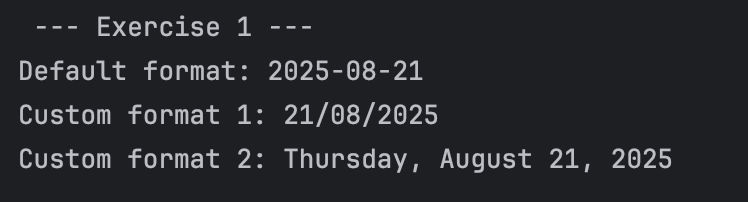
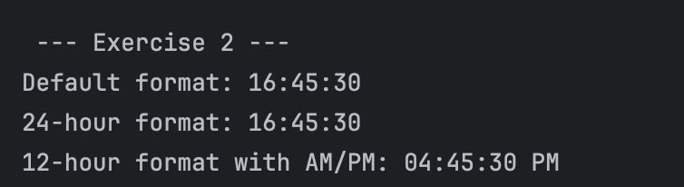
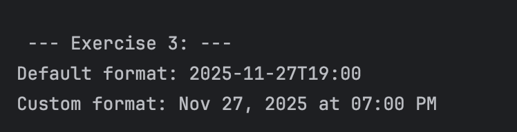
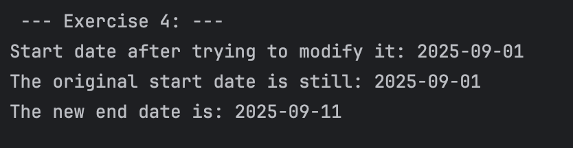
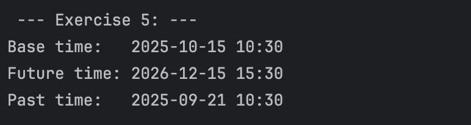
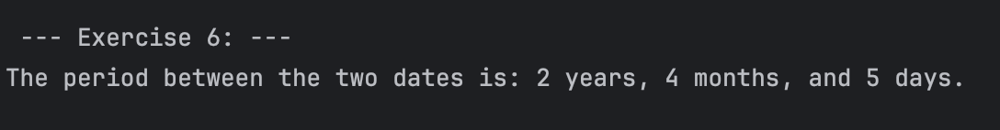

# Hands-on Lab: Working with Java's Date and Time API

---

## Lazaro, Cade Virgil C.

---

### Prediction:
The program will output "Default format: 2025-8-21", "Custom format 1: 21/08/25", "Custom format 2: Thursday, August 21, 2025".

### Observation: 
For the first two outputs, it will print expected based on the given format. On the third
output, it will also print the day of the week in English.

---

### Prediction:
It will print "Default format: 16:45:30", "24-hour format: 16:45:30", "12-hour format with AM/PM: 04:45:30 PM".

### Observation:
The default format already prints the 24-hour time format, so both default and the 24-hour 
format output will display the same thing. However, the third output will display the 
12-hour time format equivalent of the original time.

---

### Prediction:
The program will print "Default format: 2025-11-27T19:00", and "Custom format: Nov 27, 2025 at 07:00 PM".

### Observation:
The program printed as expected. The custom format just spells out the month, and the time format was changed 
to a 12-hour time.

---

### Prediction:
The program will print the original date and the edited date.

### Observation:
The program printed the expected output. This exercise showcased how the date is immutable
like the string object.

---

### Prediction:
It will print the base time of 2025-10-15 10:30:00, future time of 2026-12-15 15:30:00, 
and past time of 2025-09-21 10:30:00.

### Observation:
The program printed the expected output and the code block is pretty straightforward.

---

### Prediction:
The program will print the difference of the two given dates based on what was asked
to the program. It will print "The period between the two dates is: 2 years, 4 months, and 5 days."

### Observation:
I expected the output of the program. Since using the .period() will try to compare two
given dates, and get the differences between the two.

---

